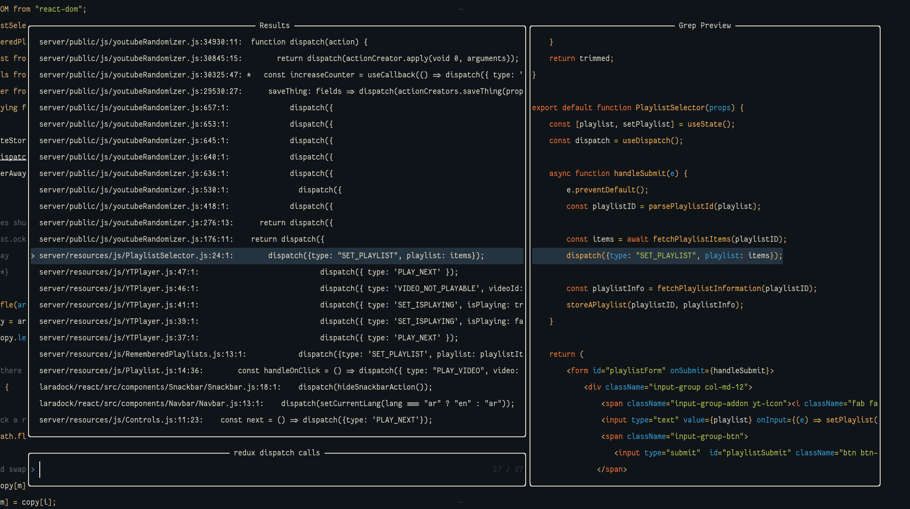
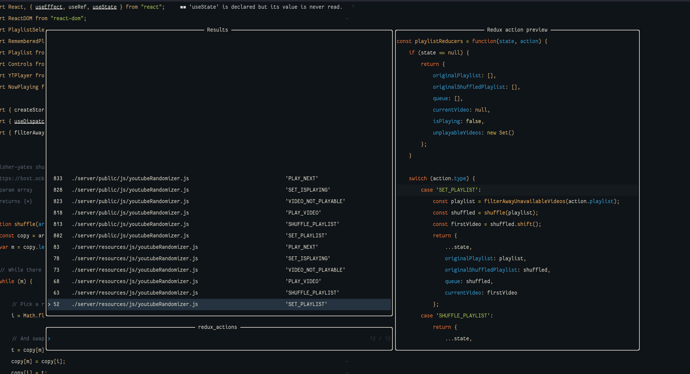

# nvim-redux

Simplify navigation in redux projects with telescope.

Treesitter queries written intelligently to find redux-related code in your entire project in milliseconds.

- ✔️ List `dispatch(ACTION)` calls in your entire project
- ✔️ List your reducer action definitions
    - ✔️ Raw definitions in switch cases
    - ✔️ redux-toolkit action definitions

## Dependencies

ripgrep needs to be available on your system.

`use 'nvim-telescope/telescope.nvim`

## Install

Note: this doesn't work on any stable release of neovim currently due to a bug in neovim's treesitter api.
The only way this plugin can work right now is by building neovim yourself. This is as of 13th of February 2022.

Confirmed to work with neovim 0.7.0 `NVIM v0.7.0-dev+1070-gf89f4b1e1`

`use 'Azeirah/nvim-redux'`

## Setup

The plugin as a whole works out of the box. The only recommendation is to add custom keybindings.

```vimscript
nmap <leader>lrd :lua require('nvim-redux').list_dispatch_calls()<CR>
nmap <leader>lra :lua require('nvim-redux').list_actions_in_switch_reducer()<CR>
```

## Functionality

### List dispatch calls in telescope



Searches your project for calls to `dispatch(...)`.

**nvim-redux.list_dispatch_calls**

### List redux action definitions in telescope



Finds all redux action definitions. Supports both raw action definitions as well as reducers defined in slices using react toolkit.

```javascript
// Find raw actions
switch (action.type) {
    case 'this_is_an_action_that_will_be_found':
        break;
}

// Reducer actions defined using redux-toolkit are also supported!
const someSlice = createSlice({
    ...
    reducers: {
        youCanFindMe: state => {...},
        andMe(state) {...}
    }
});
```

**nvim-redux.list_actions_in_switch_reducer**


